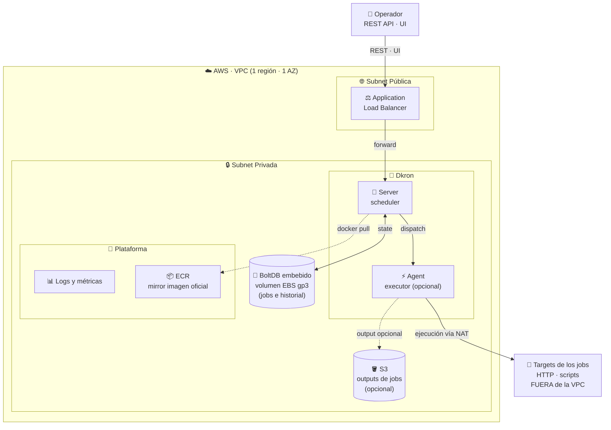
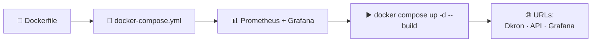
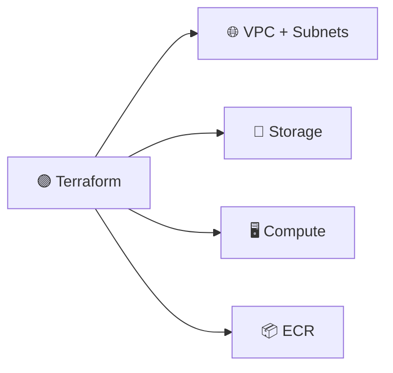
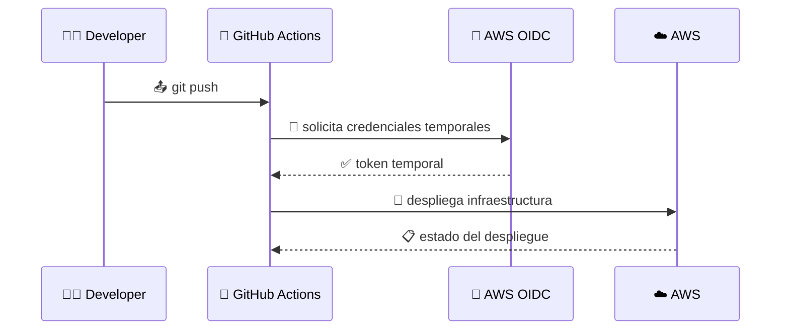

# 🚀 Reporte DevOps — Escenario D: Dkron en AWS

> 📌 Proyecto: despliegue de **Dkron** sobre AWS con IaC, automatización y observabilidad.

---

## 🏗️ Arquitectura



---

## 📋 Prerrequisitos

> ⚠️ **Nota:** Se quitó **PostgreSQL** porque Dkron solo usa volúmenes en la versión *open source*; la integración con Postgres es exclusiva de la versión **Pro**.

### 🛠️ Herramientas utilizadas

| # | Herramienta | Rol |
|---|-------------|-----|
| 1 | 🟣 **Terraform** | Infraestructura como código |
| 2 | 🔴 **Ansible** | Aprovisionamiento dentro de la VM |
| 3 | 🐙 **GitHub Actions** | Pipeline CI/CD |
| 4 | 🐳 **Docker** | Contenerización |
| 5 | 🧩 **Docker Compose** | Orquestación local |
| 6 | ☁️ **AWS** | Plataforma cloud |

---

## 💻 Fase Local



1. 📝 Se crea el archivo **Dockerfile**.
2. 🧩 Se crea el **docker-compose**.
3. 📊 Se configura para levantar también **Grafana** y **Prometheus** en Docker.

> ▶️ Con el comando `docker compose up -d --build` se levanta todo y obtenemos como resultado la URL de **Dkron**, la **API** y el **dashboard de Grafana**.

---

## ☁️ Fase Producción

Se creó una **arquitectura modular** para que sea escalable, con la siguiente estructura:
se uso esto con la finalidad de que se escalable con la finalidad si se añade mas complejidad solo añade un modulo y luego lo anexo en el archivo main principal
se esta usando backend para almacenar los cambios y no esta volviendo hacer todo de nuevo es decir en cada cambio que haga solo se añade el nuevo y lo que ya se creo se queda
tal cual para mas detalle se uso la herramienta de la guia mostrandome como es la guia en terraform pero como seria usando console de aws.

```text
dkron-aws/
├── 🧩 compose/                         # Probar en tu laptop (PARTE 3)
│   ├── docker-compose.yml
│   ├── .env.example
│   ├── prometheus/{prometheus.yml,rules.yml}
│   ├── alertmanager/alertmanager.yml
│   └── grafana/provisioning/{datasources,dashboards}/...
│
├── 🟣 infra/                           # Terraform — capa "afuera de la VM"
│   ├── bootstrap.sh                    # 4.3 — crea el bucket S3 del state
│   ├── bootstrap-oidc.sh               # 7.1 — crea OIDC provider + rol GHA
│   │
│   ├── envs/
│   │   └── prod/                       # único entorno (PDF 4)
│   │       ├── versions.tf             # 5.1.1 versiones TF + providers
│   │       ├── backend.tf              # 5.1.2 backend S3 con use_lockfile
│   │       ├── variables.tf            # 5.1.3 variables del entorno
│   │       ├── terraform.tfvars.example# 5.1.4 plantilla versionada
│   │       ├── terraform.tfvars        # 5.1.4 (gitignored: secretos)
│   │       ├── main.tf                 # 5.1.5 instancia los módulos
│   │       └── outputs.tf              # 5.1.6 outputs para Ansible
│   │
│   └── modules/                        # 5 módulos propios (PDF 5.1)
│       ├── network/                    # 5.2 — VPC + 2 pub + 2 priv + IGW + NAT
│       ├── ecr/                        # 5.3 — Repositorio ECR (mirror)
│       │                               # 5.4 — (sin módulo storage:
│       │                               #        BoltDB/EBS local)
│       ├── compute/                    # 5.5 — EC2 + ALB + SGs + IAM
│       ├── monitoring/                 # 5.7 — Prom + Grafana en Fargate
│       │   └── dashboards/dkron-red.json
│       └── cicd/                       # 7.1 — OIDC + role GHA
│
├── 🔴 ansible/                         # Capa "dentro de la VM" (PARTE 6)
│   ├── ansible.cfg
│   ├── requirements.yml
│   ├── inventories/prod/
│   │   ├── aws_ec2.yml                 # plugin dinámico (tag Project=dkron)
│   │   └── group_vars/all.yml
│   ├── roles/
│   │   ├── docker/                     # instala docker-ce + compose v2
│   │   └── dkron-compose/              # despliega el compose en la EC2
│   └── playbooks/
│       ├── site.yml                    # bootstrap completo
│       └── deploy.yml                  # deploy incremental
│
└── 🐙 .github/workflows/
    ├── ci-cd.yaml                      # PARTE 7
    └── destruir.yaml                   # PARTE 7
```

---

## 🟣 Infraestructura como Código — Terraform



Se inició por aquí, ya que **todo esto** es la parte de **infraestructura como código**:

1. 🌐 Creación de **VPC** y **Subnet**
2. 💾 **Storage**
3. 🖥️ **Compute**
4. 📦 **ECR**

> 💡 Esta sección se encarga de levantar todo lo necesario y los servicios de AWS para que estén listos para usarse. Es como si lo hicieras desde la misma consola de AWS, pero con **código**.

---

## 🔴 Aprovisionar Docker e Instalar — Ansible

En esta sección, en vez de estar conectándose vía **SSH** y usar comandos bash desde la máquina virtual para instalar, levantar y configurar todo con *bash scripts*, **Ansible** se encarga de todo este proceso de forma declarativa.

---

## 🐙 CI/CD — GitHub Actions



Todo el proceso se realiza mediante **CI/CD con GitHub Actions**. Para evitar credenciales hardcodeadas en GitHub Actions, se usó **OIDC** para que se creen **credenciales temporales** durante el despliegue.

✅ Con esto se logra:
- 🛡️ Evitar información sensible en el repositorio.
- 🔄 Uso del **CLI de GitHub** para inyectar variables necesarias al workflow.
- 🚀 Acceso seguro a AWS para desplegar.

---

## 📊 Monitoreo y Alertas — Fargate y SNS

Para esto se usa **Ansible** para provisionar el servidor y que pueda levantar y apuntar a las configuraciones que ya están en el código.

> 💰 Se usaron estas herramientas para **ahorrar costos** y porque son las que el **mundo laboral actual** solicita.

---

## 📚 Lecciones Aprendidas

| # | Entorno | 💭 Aprendizaje |
|---|---------|----------------|
| 1 | 💻 **Local** | Fue más rápido y funcionó a la perfección con pocos intentos. |
| 2 | ☁️ **Producción** | Fue dolor de cabeza por los **permisos**, **políticas**, **credenciales** y la **red** para que no se bloquee. |

---

> ✍️ *Reporte generado para el escenario D — Dkron sobre AWS.*
