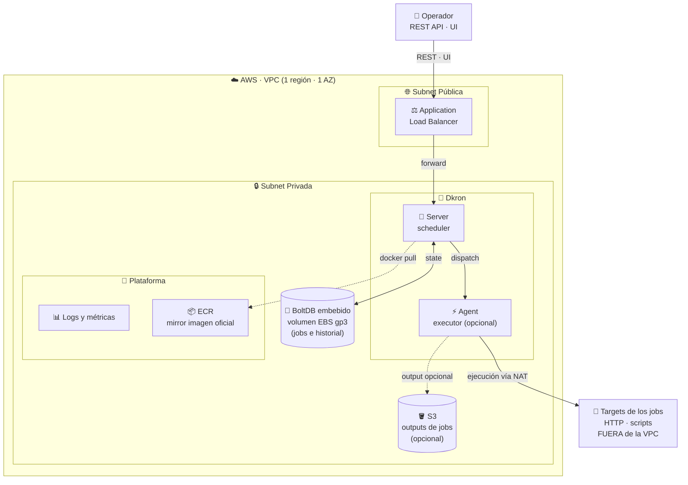
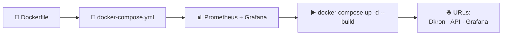
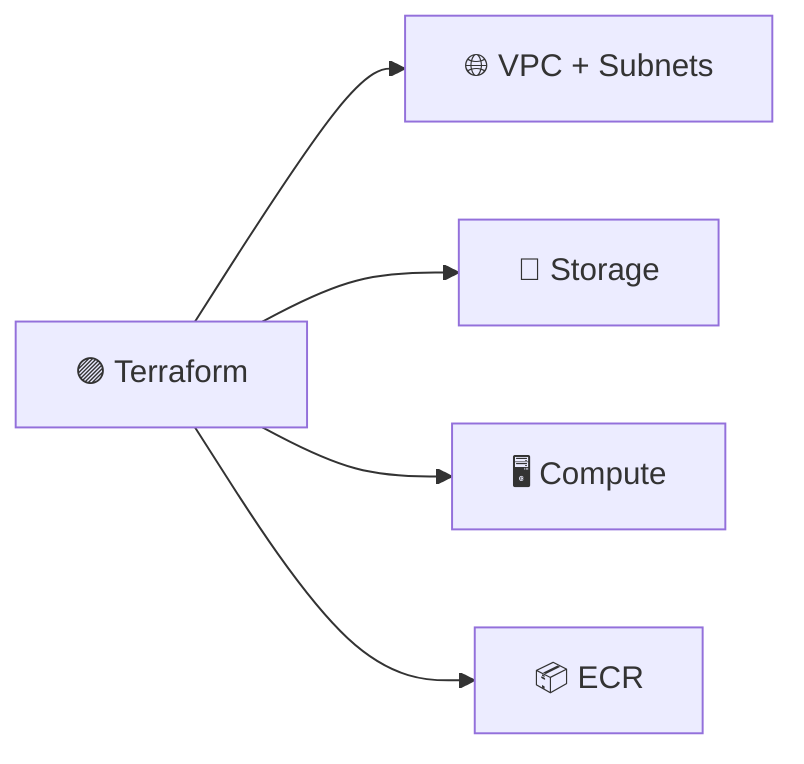
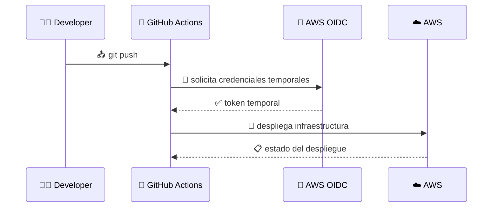

# 🚀 Reporte DevOps — Escenario D: Dkron en AWS

> 📌 **Proyecto:** despliegue de **Dkron** sobre AWS con IaC, automatización y observabilidad.
> 🎯 **Objetivo:** llevar un scheduler de jobs desde el entorno local hasta producción aplicando prácticas DevOps modernas.

---

## 📑 Índice

| # | Sección | Descripción |
|---|---------|-------------|
| 1 | [🏗️ Arquitectura](#-arquitectura) | Diagrama general del despliegue |
| 2 | [📋 Prerrequisitos](#-prerrequisitos) | Herramientas necesarias |
| 3 | [💻 Fase Local](#-fase-local) | Desarrollo y pruebas locales |
| 4 | [☁️ Fase Producción](#%EF%B8%8F-fase-producción) | Estructura modular del proyecto |
| 5 | [🟣 Terraform](#-infraestructura-como-código--terraform) | Infraestructura como código |
| 6 | [🔴 Ansible](#-aprovisionar-docker-e-instalar--ansible) | Configuración de la VM |
| 7 | [🐙 CI/CD](#-cicd--github-actions) | Pipeline automatizado |
| 8 | [📊 Monitoreo](#-monitoreo-y-alertas--fargate-y-sns) | Observabilidad y alertas |
| 9 | [📚 Lecciones](#-lecciones-aprendidas) | Reflexiones del proceso |

---

## 🏗️ Arquitectura



### 🔍 Componentes clave

| Componente | Rol | Ubicación |
|------------|-----|-----------|
| ⚖️ **ALB** | Balanceador de carga y punto de entrada | 🌐 Subnet Pública |
| 🧠 **Dkron Server** | Scheduler central de jobs | 🔒 Subnet Privada |
| ⚡ **Dkron Agent** | Ejecutor de tareas (opcional) | 🔒 Subnet Privada |
| 💾 **BoltDB** | Base de datos embebida (jobs e historial) | 🔒 EBS gp3 |
| 📦 **ECR** | Registro de imágenes Docker | 🔒 Subnet Privada |
| 🪣 **S3** | Outputs de jobs (opcional) | 🔒 Subnet Privada |

---

## 📋 Prerrequisitos

> ⚠️ **Nota importante:** Se quitó **PostgreSQL** porque Dkron solo usa volúmenes en la versión *open source*; la integración con Postgres es exclusiva de la versión **Pro**.

### 🛠️ Herramientas utilizadas

| # | Herramienta | Rol | Categoría |
|---|-------------|-----|-----------|
| 1 | 🟣 **Terraform** | Infraestructura como código | IaC |
| 2 | 🔴 **Ansible** | Aprovisionamiento dentro de la VM | Configuración |
| 3 | 🐙 **GitHub Actions** | Pipeline CI/CD | Automatización |
| 4 | 🐳 **Docker** | Contenerización | Empaquetado |
| 5 | 🧩 **Docker Compose** | Orquestación local | Orquestación |
| 6 | ☁️ **AWS** | Plataforma cloud | Cloud Provider |

### ✅ Checklist previo al despliegue

- [x] 🔑 Cuenta AWS con permisos administrativos
- [x] 🐳 Docker y Docker Compose instalados localmente
- [x] 🟣 Terraform `>= 1.5` instalado
- [x] 🔴 Ansible `>= 2.14` instalado
- [x] 🐙 Repositorio GitHub con Actions habilitado
- [x] 🪣 Bucket S3 para el backend de Terraform

---

## 💻 Fase Local



### 🔧 Pasos seguidos

| Paso | Acción | Resultado |
|------|--------|-----------|
| 1️⃣ | 📝 Crear archivo **Dockerfile** | Imagen lista para construir |
| 2️⃣ | 🧩 Crear **docker-compose.yml** | Stack orquestado |
| 3️⃣ | 📊 Configurar **Grafana** y **Prometheus** | Observabilidad lista |
| 4️⃣ | ▶️ Ejecutar `docker compose up -d --build` | Servicios arriba |

### 🌐 URLs locales obtenidas

| Servicio | URL local |
|----------|-----------|
| 📅 **Dkron UI** | `http://localhost:8080` |
| 🔌 **Dkron API** | `http://localhost:8080/v1/jobs` |
| 📊 **Grafana** | `http://localhost:3000` |
| 📈 **Prometheus** | `http://localhost:9090` |

> 💡 **Tip:** Esta fase permite validar la configuración antes de gastar recursos en la nube. Si funciona en local, hay mucha más probabilidad de que funcione en producción.

---

## ☁️ Fase Producción

Se diseñó una **arquitectura modular** pensada para escalar y mantener el código limpio.

### 🎯 ¿Por qué modular?

| Ventaja | Descripción |
|---------|-------------|
| 📈 **Escalabilidad** | Si se añade más complejidad, solo se crea un módulo nuevo y se anexa en el `main.tf` principal |
| 🔄 **Reutilización** | Los módulos se pueden reusar en otros entornos sin duplicar código |
| 💾 **Backend remoto** | Almacena los cambios en S3 — Terraform no reconstruye todo, solo aplica las diferencias |
| 🧹 **Mantenibilidad** | Cada módulo tiene una responsabilidad única, facilitando ediciones |

> 📌 **Nota técnica:** El uso de backend remoto evita que cada `terraform apply` recree recursos. Solo se añaden o modifican los recursos cambiados; el resto permanece intacto.

### 📂 Estructura del proyecto

```text
dkron-aws/
├── 🧩 compose/                         # Probar en tu laptop (PARTE 3)
│   ├── docker-compose.yml
│   ├── .env.example
│   ├── prometheus/{prometheus.yml,rules.yml}
│   ├── alertmanager/alertmanager.yml
│   └── grafana/provisioning/{datasources,dashboards}/...
│
├── 🟣 infra/                           # Terraform — capa "afuera de la VM"
│   ├── bootstrap.sh                    # 4.3 — crea el bucket S3 del state
│   ├── bootstrap-oidc.sh               # 7.1 — crea OIDC provider + rol GHA
│   │
│   ├── envs/
│   │   └── prod/                       # único entorno (PDF 4)
│   │       ├── versions.tf             # 5.1.1 versiones TF + providers
│   │       ├── backend.tf              # 5.1.2 backend S3 con use_lockfile
│   │       ├── variables.tf            # 5.1.3 variables del entorno
│   │       ├── terraform.tfvars.example# 5.1.4 plantilla versionada
│   │       ├── terraform.tfvars        # 5.1.4 (gitignored: secretos)
│   │       ├── main.tf                 # 5.1.5 instancia los módulos
│   │       └── outputs.tf              # 5.1.6 outputs para Ansible
│   │
│   └── modules/                        # 5 módulos propios (PDF 5.1)
│       ├── network/                    # 5.2 — VPC + 2 pub + 2 priv + IGW + NAT
│       ├── ecr/                        # 5.3 — Repositorio ECR (mirror)
│       │                               # 5.4 — (sin módulo storage:
│       │                               #        BoltDB/EBS local)
│       ├── compute/                    # 5.5 — EC2 + ALB + SGs + IAM
│       ├── monitoring/                 # 5.7 — Prom + Grafana en Fargate
│       │   └── dashboards/dkron-red.json
│       └── cicd/                       # 7.1 — OIDC + role GHA
│
├── 🔴 ansible/                         # Capa "dentro de la VM" (PARTE 6)
│   ├── ansible.cfg
│   ├── requirements.yml
│   ├── inventories/prod/
│   │   ├── aws_ec2.yml                 # plugin dinámico (tag Project=dkron)
│   │   └── group_vars/all.yml
│   ├── roles/
│   │   ├── docker/                     # instala docker-ce + compose v2
│   │   └── dkron-compose/              # despliega el compose en la EC2
│   └── playbooks/
│       ├── site.yml                    # bootstrap completo
│       └── deploy.yml                  # deploy incremental
│
└── 🐙 .github/workflows/
    ├── ci-cd.yaml                      # PARTE 7
    └── destruir.yaml                   # PARTE 7
```

### 🗂️ Resumen de carpetas

| 📁 Carpeta | 🎯 Responsabilidad | 🛠️ Tecnología |
|------------|--------------------|----------------|
| `compose/` | Entorno local de desarrollo | 🐳 Docker Compose |
| `infra/` | Infraestructura cloud | 🟣 Terraform |
| `ansible/` | Configuración dentro de EC2 | 🔴 Ansible |
| `.github/workflows/` | Pipeline CI/CD | 🐙 GitHub Actions |

> 💡 **Comentario del autor:** La idea fue replicar lo que harías desde la consola de AWS, pero en código. La guía mostraba el flujo en Terraform y se complementó con conceptos vistos al usar la consola para entender el "por qué" de cada recurso.

---

## 🟣 Infraestructura como Código — Terraform



Se inició por aquí, ya que **todo esto** es la parte de **infraestructura como código**.

### 📦 Recursos provisionados

| # | Recurso | Función | Módulo |
|---|---------|---------|--------|
| 1 | 🌐 **VPC + Subnets** | Red privada y pública con NAT Gateway | `modules/network` |
| 2 | 💾 **Storage** | Volumen EBS para BoltDB | (sin módulo, local) |
| 3 | 🖥️ **Compute** | EC2 + ALB + Security Groups + IAM | `modules/compute` |
| 4 | 📦 **ECR** | Registro privado de imágenes Docker | `modules/ecr` |
| 5 | 📊 **Monitoring** | Prometheus + Grafana en Fargate | `modules/monitoring` |
| 6 | 🔐 **CI/CD** | OIDC provider + IAM role para GitHub | `modules/cicd` |

> 💡 **Razón de ser:** Esta sección levanta todos los servicios de AWS necesarios para que estén listos para usarse. Es como hacerlo desde la consola de AWS, pero con **código versionable y reproducible**.

### ✅ Ventajas de usar Terraform

- 🔄 **Idempotencia:** ejecutar varias veces produce el mismo resultado.
- 📝 **Versionable:** la infraestructura vive en Git.
- 👥 **Colaborativo:** múltiples ingenieros pueden trabajar sin pisarse.
- 🧹 **Destructible:** un solo comando elimina todo cuando ya no se necesita.

---

## 🔴 Aprovisionar Docker e Instalar — Ansible

En esta sección, en vez de conectarse vía **SSH** y ejecutar comandos bash manualmente para instalar y configurar todo, **Ansible** se encarga del proceso de forma **declarativa**.

### 🆚 Comparativa: SSH manual vs. Ansible

| Aspecto | 🔧 SSH + bash | 🔴 Ansible |
|---------|---------------|------------|
| ⏱️ **Tiempo** | Lento, propenso a errores | Rápido y reproducible |
| 🧪 **Idempotencia** | No garantizada | Sí, garantizada |
| 📝 **Versionado** | Difícil | Natural (YAML en Git) |
| 👥 **Colaboración** | Compleja | Simple |
| 🔄 **Re-ejecución** | Riesgosa | Segura |

### 🎭 Roles de Ansible utilizados

| Rol | Función |
|-----|---------|
| 🐳 **docker** | Instala Docker CE y Docker Compose v2 |
| 📅 **dkron-compose** | Despliega el stack de Dkron en la EC2 |

> 💡 **Inventario dinámico:** se usa el plugin `aws_ec2` con el tag `Project=dkron` para descubrir instancias automáticamente, sin hardcodear IPs.

---

## 🐙 CI/CD — GitHub Actions



Todo el proceso se realiza mediante **CI/CD con GitHub Actions**.

### 🔐 ¿Por qué OIDC y no claves estáticas?

Para evitar credenciales hardcodeadas en GitHub, se usó **OIDC** para que se generen **credenciales temporales** en cada despliegue.

| 🚫 Antes (claves estáticas) | ✅ Ahora (OIDC) |
|------------------------------|-----------------|
| Claves AWS guardadas en GitHub Secrets | Credenciales temporales por ejecución |
| Rotación manual | Renovación automática |
| Riesgo de filtración | Sin secretos en reposo |
| Difícil auditoría | Trazabilidad por ejecución |

### 📦 Workflows implementados

| Workflow | Propósito |
|----------|-----------|
| 🚀 `ci-cd.yaml` | Despliega toda la infraestructura automáticamente |
| 🧹 `destruir.yaml` | Elimina todos los recursos para evitar costos |

> 💡 Se añadió un **summary** en el workflow para verificar que los endpoints estén disponibles desde internet una vez termina el despliegue.

### 🌐 Resumen del despliegue (`ansible-deploy summary`)

| 🔌 Servicio | 🌐 URL |
|-------------|--------|
| 📅 **Dkron UI** | http://dkron-alb-1805524791.us-east-1.elb.amazonaws.com/ |
| 🔌 **Dkron API (jobs)** | http://dkron-alb-1805524791.us-east-1.elb.amazonaws.com/v1/jobs |
| 📊 **Grafana** | http://dkron-alb-1805524791.us-east-1.elb.amazonaws.com:3000 |
| 📨 **Alertmanager → SNS (Lambda URL)** | https://js5wccvizzrkjkepa2cimdotre0scnjm.lambda-url.us-east-1.on.aws/ |

### ✅ Logros con esta configuración

| Beneficio | Detalle |
|-----------|---------|
| 🛡️ **Seguridad** | Sin información sensible en el repositorio |
| 🔄 **Automatización** | Uso del **CLI de GitHub** para inyectar variables al workflow |
| 🚀 **Acceso controlado** | Acceso seguro a AWS para desplegar |
| 🧹 **Limpieza fácil** | Workflow dedicado para destruir todo el stack |

---

## 📊 Monitoreo y Alertas — Fargate y SNS

Para el monitoreo se usa **Ansible** para provisionar el servidor de modo que pueda levantar y apuntar a las configuraciones ya definidas en el código.

### 🛠️ Stack de observabilidad

| Componente | Función | Plataforma |
|------------|---------|------------|
| 📈 **Prometheus** | Recolección de métricas | 🟦 Fargate |
| 📊 **Grafana** | Visualización de dashboards | 🟦 Fargate |
| 🚨 **Alertmanager** | Gestión de alertas | 🟦 Fargate |
| 📨 **SNS** | Notificación de alertas | ☁️ AWS |
| ⚡ **Lambda** | Bridge Alertmanager → SNS | ☁️ AWS |

### 💰 ¿Por qué Fargate y no EC2?

| Razón | Detalle |
|-------|---------|
| 💸 **Costos** | Solo pagas por lo que usas, sin gestión de instancias |
| 🛠️ **Mantenimiento** | AWS gestiona el sistema operativo |
| 📈 **Demanda laboral** | Es una tecnología muy solicitada en el mundo laboral actual |
| ⚡ **Rapidez** | Despliegue rápido sin aprovisionar VMs |

> 💰 Se eligieron estas herramientas para **ahorrar costos** y porque son las que el **mundo laboral actual** solicita.

---

## 📚 Lecciones Aprendidas

| # | Entorno | 🟢 / 🔴 | 💭 Aprendizaje |
|---|---------|---------|----------------|
| 1 | 💻 **Local** | 🟢 | Fue más rápido y funcionó a la perfección con pocos intentos. |
| 2 | ☁️ **Producción** | 🔴 | Dolor de cabeza por **permisos**, **políticas**, **credenciales** y la **red** para evitar bloqueos. |

### 🎓 Reflexiones clave

| 🔑 Tema | 💡 Aprendizaje |
|---------|----------------|
| 🔐 **IAM y políticas** | El principio de mínimo privilegio es esencial, pero requiere muchas iteraciones |
| 🌐 **Networking AWS** | Security Groups, NACLs y rutas son la causa #1 de problemas iniciales |
| 🔄 **OIDC** | Vale la pena el esfuerzo inicial — se gana en seguridad y simplicidad |
| 🧩 **Modularidad** | Separar Terraform en módulos paga dividendos al iterar |
| 🤖 **Ansible** | Eliminar el "hacer manual por SSH" reduce errores drásticamente |

### 🚀 Próximos pasos sugeridos

- [ ] 🌍 Multi-AZ para alta disponibilidad
- [ ] 🔁 Auto Scaling para los agents de Dkron
- [ ] 🔒 Certificados SSL/TLS en el ALB (HTTPS)
- [ ] 📦 Backups automáticos del volumen EBS
- [ ] 📊 Dashboards adicionales en Grafana

---

> ✍️ *Reporte generado para el escenario D — Dkron sobre AWS.*
> 📅 *Última actualización: 2026-05-18*
